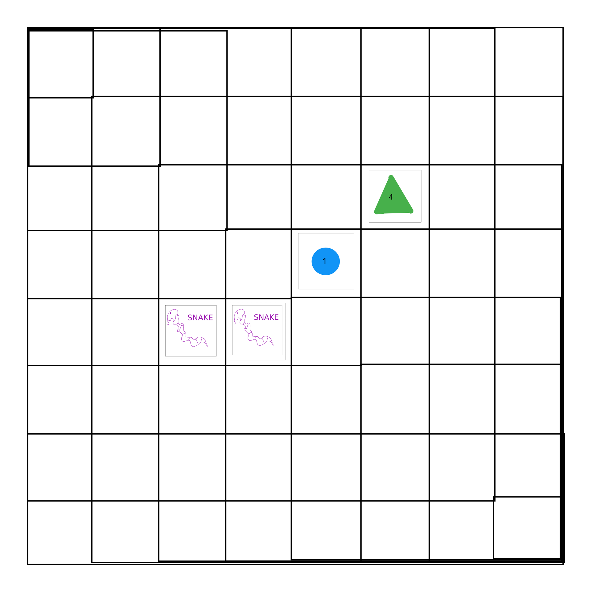
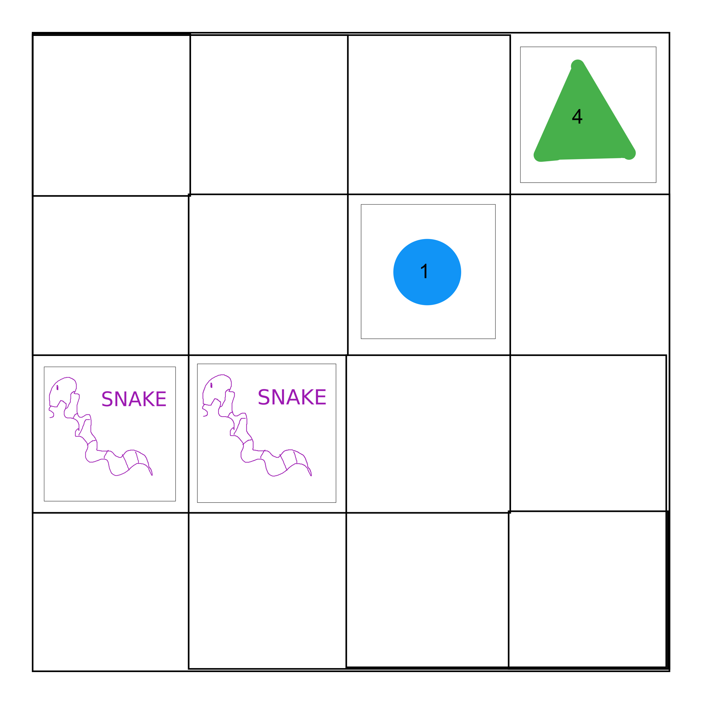

// NOT FINALIZED //

# Matches and Patches

INTRO TEXT TK

## Game Elements
The game will involve 1 board, 2 players, 64 standard tiles, 128 player tiles, and an interface that will run the game on an internet browser.

### Tiles
The 64 distinct standard tiles will be broken up into 3 categories, each featuring 4 subcategories, which will span across the categories (4 to the power of 3 will yield 64). The three categories will be color, shape, and number. Color's subcategories will be red, blue, yellow, and green. Shape's subcategories will be triangle, square, hexagon, and circle. Number's subcategories will be 1, 2, 3, and 4. As a result, there will be 16 red tiles, 16 triangle tiles, etc. For example, the 16 red tiles will include 4 triangles numbered 1 to 4, along with 4 circles numbered 1 to 4, etc.

*Some example standard tiles:*

In addition to the standard tiles, there are 128 non-distinct player tiles. Each player will only have one style of tile, and it will be used to indicate that they have won a particular cell on the board. There are only 128 of them in order to account for the possibility that 1 player may capture all 64 of the board's cells. However, the 128 number is only to account for an analog physical game set (or a hardcoded game); in practice, there will only be 2 pieces, stored as 2 elements in the code.

*The user's tile:*

*The opponent's tile:*

### Board
The board for the full game will be an 8-by-8 board, comprising 64 cells, analogous to a chess board. During production, there will also be a smaller, 4-by-4 board, comprising 16 cells. Upon completion, the user may have the option to play using either the large board or the small board. (Note: In both scenarios, the game will use all 64 tiles described above.)

*Large board:*

*Small board:*

### Interface
The game will run in the window of an internet browser. The user will play the game by clicking on different parts of the screen. For instance, for each move, they would click on the tile they want to play as well as the cell on the board on which they want to play that tile, then click a submit button to finalize their move. (See below, in the 'Game Play' section, for wireframes of the interface.)

### Players
The game involves 2 players. However, to make it more enjoyable for the user, they will be playing against an AI instead of another user. The user will henceforth be referred to as 'the user,' and the AI will henceforth be reffered to as 'the opponent.'

## Game Rules
The goal of the game is to match as many tiles as you can. You can try to match your tile with more than one other tile on the board. You can also use some game theory and particularly put your tiles in places that don't benefit you hopefully hurt your opponent.

### Setup
The board begins empty, and each player is dealt 4 tiles. Players can only see their own tiles.

### Rounds
In each round, the player will place 1 tile on the board. They will subsequently be dealt 1 new tile from the deck. As a result, they will always have 4 tiles (until the end of the game, unless they play using the small board). Each player plays their tiles simultaneously each round. That means the user will not know what tile the opponent will play or where the opponent will play it until after they both play their tiles. Since their are 64 tiles for 64 cells and each round involves playing 2 tiles (1 from each player), then the game can last a maximum of 32 rounds (or 8 rounds on the small board).

### First Move
Each player must make their first move on their respective center cell on the table. In other words, they must place their tile in the fourth row of the fourth column, from their point of view. No capturing will occur as a result of the first move; it merely 'sets the table.'

*Possible first move with the large board:*

*Possible first move with the small board:*

### Subsequent Moves
After the first move, each player can place their tiles on any cell on the board, *as long as that cell touches another cell that is currently occupied by another tile*. 'Touching' involves sharing either an entire edge or merely a corner. For example, in the second move, a player could place their tile on the cell in the third row of the third column. However, that player could not place their tile on the cell in the first row of the first column.

*Example of a valid second move with the large board:*

*Example of a valid second move with the small board:*

### Capturing
The goal is to 'capture' as many cells on the board as possible. To do that, you need to place a tile that matches an adjacent tile or tiles in one or multiple ways. Examples of matches include having the same number, color, or shape as the other tile (or any combination of those). Upon placing a tile that matches an adjacent tile already on the board, the player will 'capture' both cells involved in the match (i.e., the original cell already occupied on the board that contained the tile being matched and the new cell containing the tile played to match it). Players may also capture multiple cells in one round. (Note: The players may both try to match the same tile or tiles in the same round. In which case, there is a 'conflict.' See below on how those are handled.) When tiles are first played during a round, they will appear as the standard tiles. Only after 1 second's pause will the standard tiles involved in the 'capture' be replaced by the captor's player tile.

*Possible second move with a single match before the cells are filled with player's individual tiles on the large board:*

*How the board will look after the cells are filled with the player's individual tiles on the large board:*

*Possible second move with a single match before the cells are filled with player's individual tiles on the small board:*

*How the board will look after the cells are filled with the player's individual tiles on the small board:*

### Winning
The player who captures the most cells on the board wins the game. This can happen in one of two main ways, with some caveats about possible ties. In the first scenario, the entire board will be filled with tiles, and the player with the most captured cells wins. (In this scenario, the game lasts 32 rounds.) In the second scenario, the player who captures more than 32 cells first wins. (In this scenario, the game can terminate prior to 32 rounds.) These numbers obviously adjust accordingly for games played on the small board. (Note: It's possible for some cells to have standard tiles and remain 'uncaptured' after completely filling the board. These are called orphans, and they will be discussed in 'Rare Scenarios' below.)

### Potential Conflicts
Since each player plays their tiles simultaneously, it is possible for both players to attempt to play different tiles on the same cell in a given round. In that case, the cell goes to the player whose 'side' it 'belongs' to. The horizontal midline that separates the fourth and fifth rows divides the board into these two 'sides.' The cells from the first through fourth rows all initally 'belong' to the user; while the cells from the fifth through the eight rows all initially 'belong' to the opponent. After determining which player gets the cell, the other player must still play the tile they intially chose in a different cell on the board. (Note: Whoever wins that initial cell will automatically win any adjoining cells that the player is attempting to match; the other player cannot try to contest them in a possible match pair hierarchy.) As a result, if both players attempt to place a tile on the cell at the fourth row of the fifth column, the cell would go to the user, since it falls on their side.

Additionally, since the goal of the game is to 'match' ones tiles with the tiles already on the board, it's possible that both players may try to match the same tile (or tiles) simultaneously. In this scenario, the match is said to be in 'conflict,' and the player with the stronger match with the tile (or tiles) will win them. If both players have the same level of match with the given tile, then no player gets it, and all tiles involved remain uncaptured and as standard tiles (not individual player tiles). See 'Hierarchy of Match Pairs' below for explanations on how to handle trickier match conflicts, and observe how uncaptured cells from match pairs may become permanent orphans in 'Rare Scenarios.'

In this scenario, both players are attempting to match with the yellow triangle. The user played the green triangle, while the opponent played the yellow circle:

The user wins the contest since their tile shares two features with the contested tile: The user's tile is both a triangle and a 2, as is the contested tile. In contrast, the opponent's tile only shares one feature with the contested tile: They are both yellow. As a result, the user's individual tiles (i.e., the eagle tiles) replace both the tile they played and the tile contested:

*Same example on the small board:*

As mentioned before, the players may attempt to match their tile with more than one tile on the board in a given round. This leads to more complex match pairs, which leads to more complex match conflicts.

In this scenario, both players are attempting to match with the red square and the blue circle. The user plays the yellow circle with a 3, while the opponent plays the blue circle with a 3. The user's tile matches its 3 with the red square and its circle with blue circle; while, the opponent's tile matches its 3 with the red square and both its shape and color with the blue circle with a 1:

The opponent wins the conflict because it matches 2 criteria with 1 of the contested tiles and 1 criteria with the other tile, for a total of 3 matches. In contrast, the user only had 1 match with each of the contested tiles, for a total of only 2 matches. As a result, the opponent's tiles (i.e., a snake) replace the key tiles:

*Same example on the small board:*

### Rare Scenarios
In the above scenarios, we discussed match pairs that would result with no captures. Some of those may find themselves no only not paired in that round but rather in the unenviable position of never being paired in the future. In short, they become permament orphans, since depending on their position, no one may be able to ever reach them again.

In the below example, the yellow circle attempts to match the yellow triangle, while the blue circle tries to match the yellow tringle since they both have same number. However, since they both only have 1 connection, neither of them can win, and all tiles remain unconquered. Unfortunately, the yellow trianle is now boxed in on all sides. Since it wasn't possible to match in the previous step, then it will never be able to pair with any tile. It is a permanent orphan.

### Hierarchy of Match Pairs
With complicated match pairs, a numerical method is need to clarify the score in any given match pair conflict. In general, the less pieces involved and the less commonalties they share, the lower their score. However, here's a more explicit breakdown of how to assign points to hypothetical match pairs to determine the winner (or ties):

In this rare instance, a player manages to capture five cells at once:

In the previous step, only the red square, blue cirlce, and yellow and green triangles were on the board, all merely connected by their corners. The user plays a blue triangle in the center of all of them. It matches the 3 of the red square, the blue of the circle above it, and the triangle shape of the two other figures. While the opponent played the red circle, and it has a strong match with the two cells it touches (it shares shape and number with the blue circle, and it shares color with the red square), the other pair is stronger. As a result, the user wins, and the user's eagle tiles now appear on all five cells:

## Game Play
### Landing Page
### Slideshow
### Starting the Game
### Playing the Game
### End of Game

## Full Version vs. Partial Version
### Large Board vs. Small Board
### Dumb AI vs. Smart AI

## Coding Concepts
### HTML
### CSS
### JavaScript
#### Arrays
#### Objects
#### Logic
#### Functions
#### Event Listeners
#### Promises

## Plan
This is merely an initial plan; it will likely change multiple times. However, it provides some reasonable goals, especially for the middle and end of the week.

### Timeline
Nov. 1: Adjust plan based on feedback from instructor

Nov. 2: Create repo, file structure, and basic content (e.g., board, cards, landing page); finalize game plan

Nov. 3: Set game flow logic in JavaScript

Nov. 4: Work on advanced logic aspects as well as integration and initial troubleshooting; at this stage, the game should be playable but not styled and with a few errors

Nov. 5: Build in the materials and user experience; this stage will constitute the first pass at seriously styling the game

Nov. 6: Tackle advanced styling, set up the live site, and fill out the readme file

Nov. 7: Play game extensively and get friends and family to also try it out

Nov. 8: Optimize for other platforms; edit it to maximize its aesthetic appearance

Nov. 9: Finalize by repeatedly troubleshooting and debugging

Nov. 10: Present final product to cohort

### File Structure
Possible files by file type:
- HTML: landing page; game page; cards page
- CSS: board styling; card styling; intro styling
- JavaScript: logic for game play; moves on board game; transitions and event listeners with DOM
- Markdown: README to provide explanatory info

Possible file hierarchies:
- First option's main folder
    - index.html
    - readme.md
    - text folder
        - cards.html
        - introduction.html
    - style folder
        - board.css
        - cards.css
        - introduction.css
    - script folder
        - game.js
        - moves.js
        - app.js
- Second option's main folder
    - index.html
    - readme.md
    - introduction folder
        - text.html
        - style.css
        - app.js
    - cards folder
        - images.html
        - style.css
    - board folder
        - style.css
        - main.js
        - game.js